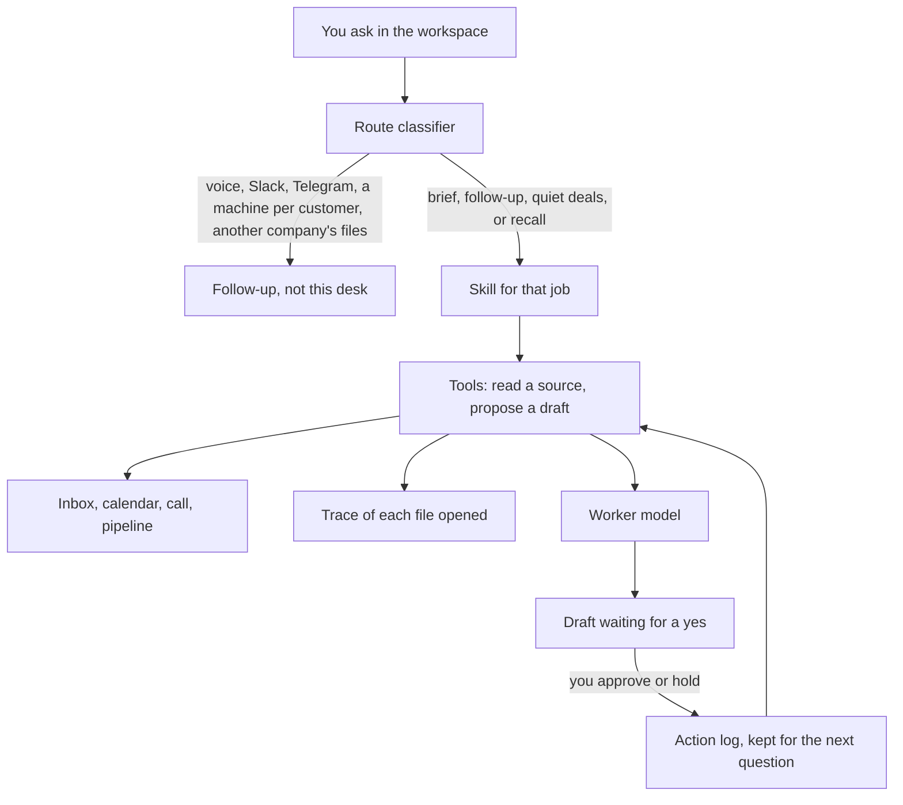

# Problem framing

## The problem

After a customer call, the decision is already made. The follow-up that would carry it is not.

The agreement sits in the call note. A different version sits in an unsent draft. Overnight mail asks you to confirm the other version, in writing, before a security review. The calendar already puts that review on top of a block you meant to keep clear. Together they are about to become the wrong commitment, because the draft says John will open the payroll mailbox and mail the CFO every Friday on its own, and the call said the opposite: payroll stays closed, and the CFO is mailed only after Priya says yes.

The person this is for is the owner of that workspace. The moment is the morning after the call, before the follow-up goes out.

This is one journey. It is the journey paying customers already hire John for: finish the follow-up, see what in the inbox and calendar cannot wait, notice which deals went quiet, and do not send until they say so. Harbor Ops in the demo packet is sample data standing in for that job. It is not a named customer.

## Why this problem

A judge scoring this brief is asking whether the problem is real, whether it is one problem, whether AI is required, whether the demo can prove it, and whether the team knows what they are not building. The answers below are those questions.

**Why this one, and not the other five on the brief?**
The brief asks for one meaningful problem. The one that holds the others is: turn the meeting, the emails, and the documents into a decision and an action. Finding the files is the setup. A workflow builder is a script. A decision dashboard is a summary. Coordination and risk only matter once an action is about to leave. Those show up inside this journey. They are not separate products.

**Is the example heavy enough for the problem?**
The cost of getting this wrong is not a missed to-do. The follow-up is written permission to open payroll, and a promise that the CFO will be mailed every Friday with no one checking the number. If the draft leaves, their security review files that mail. A salary file in a mailbox the finance team shares is your incident if it leaks. A wrong number in the CFO's inbox is the number they report upward. A recap of the call would still look fine. The mail is the record. That is the weight.

**Where does AI actually do the work?**
No single file says the draft is wrong. The call note states the agreement. The inbox states the other ask. The unsent draft states what is about to go out. The model has to read them together, say what was decided, name the contradiction, and write the corrected reply. A search box returns passages. A rule returns what you already scripted. Counting quiet deals on a sheet is arithmetic. Choosing the follow-up that matches the call, and refusing to send it, is the model.

**Why is this not a generic "meeting to tasks" demo?**
Meeting notes into bullets is what every team will show. This desk does not stop on the bullets. It holds the reply until you approve it, writes that approval into the workspace, and can answer "what did we already commit?" from that log. It also refuses work that is not in this workspace, including another company's files.

**What is in the demo, and what is a follow-up?**
In the demo: the inbox, the calendar, yesterday's call, the pipeline, and the action log. You can ask for the morning brief, the corrected follow-up, the quiet deals, or what you already approved. Voice updates, Slack, Telegram, a machine per customer, live mail and calendar connections, and a brief that arrives on its own are follow-ups. They are how the full product meets you. They are not required to show this problem.

**What assumptions will you state?**
The packet is synthetic. Approving writes the draft to this workspace's action log. No live mailbox is connected. "Send" means you allowed the draft to be recorded, not that an email left the building.

**How will a judge see that the AI is real?**
The classifier only labels the request: morning brief, follow-up, quiet deals, recall, or refused. The worker then reads this workspace and returns decisions, risks, and drafts with quotes taken from the sources. The answers are not stored in the app. If the question is about voice, Slack, or another company's files, it stops before a draft is written. The screen shows the skill that loaded, each file the tools opened, and the action log the next question reads.

## What we take from Hermes

Hermes is the agent John already runs: one agent, its own memory, and tools instead of a single pasted prompt. Three of those behaviors are on screen in this demo. Voice, schedules, and a machine per customer are not.

**A skill for the job.** Hermes does not start from a blank prompt. The route picks a skill, and the demo names it: morning brief, close the follow-up, quiet deals, or recall. The judge sees which instructions ran for that question.

**Tools that can only open this workspace.** Hermes reads by calling a tool. The trace lists each call: the call note, the inbox, the calendar, the pipeline. There is no tool for another company's files, so a question about them cannot open them. The draft is a second tool, `propose a draft`. It does not send.

**Memory that is still there on the next question.** Hermes keeps memory with the agent, not inside one reply. Approving writes the action log. The following question, "what did we already commit?", is answered from that log. The log was empty at the start of the demo, so the second answer cannot have been written in advance.

## Architecture

Inference, when an OpenRouter key is set: the classifier is DeepSeek V4 Flash, and the worker is DeepSeek V4 Pro. The classifier returns a label. It does not write the email, and it does not see files from outside the workspace.
