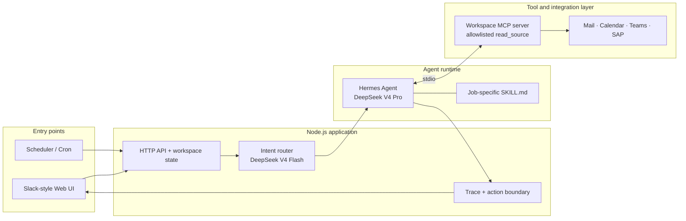

# John — Technical Solution Architecture

**Objective:** close enterprise workflow handoffs by giving one scoped AI agent the context, skills, and tools required to produce a grounded next action—without granting unrestricted system access.

## System architecture

## Technical stack

- **Frontend:** semantic HTML, CSS, and vanilla JavaScript; Slack-style interaction, integration setup, source inspection, workflow visualisation, and tool trace.
- **Application runtime:** Node.js 22; framework-free HTTP server serving static assets and JSON endpoints on port `4740`.
- **Model gateway:** OpenRouter. DeepSeek V4 Flash performs low-cost deterministic intent routing; DeepSeek V4 Pro performs tool-using reasoning.
- **Agent framework:** Hermes Agent in one-shot mode. Each routed job loads one versioned `SKILL.md`; interactive access to terminal, browser, web, general files, and sending is disabled.
- **Tool protocol:** Model Context Protocol over `stdio`. The dedicated workspace MCP exposes only `read_source` and approval-gated draft storage.
- **Data and state:** JSON-backed integration records, connected-source IDs, pending draft, and action log. An app-specific `HERMES_HOME` keeps agent configuration, sessions, and trace data isolated.
- **Testing and delivery:** Playwright browser smoke test; npm scripts; single Node process deployable behind Caddy/nginx or a secure tunnel.

## Request execution

1. `server.mjs` receives a Slack request or scheduled event and validates workspace readiness.
2. Flash returns only an allowed route label; cross-workspace requests stop before Hermes starts.
3. The server invokes Hermes with the selected skill, provider, worker model, and bounded turn budget.
4. Hermes calls the workspace MCP. MCP checks both the source allowlist and whether that source is connected.
5. The worker reconciles returned records and produces a grounded response. The server returns the answer, selected skill, opened-source trace, and any proposed action.

## Security and control plane

- **Least privilege:** tools accept source IDs, not arbitrary paths or credentials.
- **Tenant boundary:** disconnected or foreign workspace sources cannot be opened; removing a source revokes access immediately.
- **Prompt-independent enforcement:** access checks live in MCP and server code, below model instructions.
- **Action separation:** reading, proposing, approving, and executing are separate capabilities; this build does not send mail or create reminders.
- **Auditability:** the UI exposes the selected skill and tool calls; approved/held decisions can be persisted separately from chat history.
- **Secrets:** the OpenRouter key stays in `.env` and the local Hermes home; it is never sent to the browser.

## Operational topology and failure handling

- The browser is an untrusted presentation surface. It receives workspace metadata and answers, never provider credentials or arbitrary filesystem access.
- The Node host is the orchestration boundary: `/api/workspace` manages connections, `/api/source/:id` exposes inspectable records, `/api/ask` runs the agent, and `/api/health` verifies Hermes/model readiness.
- Each request invokes Hermes as a bounded child process. Hermes launches the MCP server over `stdio`; MCP returns structured source payloads and the server reconstructs the visible trace from the agent session.
- Refusals stop before model tools; missing sources disable Ask; tool/model failures return an explicit UI error instead of silently continuing.
- Production hardening adds authenticated tenant identity, encrypted connector credentials, durable state, queued workers, retries/idempotency for approved actions, metrics, and alerting.

## Key architecture decisions

- **Two-model split:** keep frequent intent routing fast and inexpensive while reserving the stronger worker for grounded multi-source reasoning.
- **Skills over one giant prompt:** each job has versioned, reviewable instructions and a bounded tool surface.
- **MCP as the integration seam:** models never receive connector credentials; local adapters can become Microsoft Graph, Teams, or SAP clients without changing skills.
- **Deterministic controls around probabilistic reasoning:** code owns source access, refusal, action gates, and audit; the model owns interpretation and response composition.

## Prototype implementation vs production adapters

**Implemented and executable:** Node API/UI, live model inference, Hermes skill execution, MCP source isolation, inspectable integration payloads, source revocation, refusal, and trace.

**Represented in the prototype:** Microsoft 365, Teams, SAP, Slack, and the 15:30 trigger use local adapters/UI simulation. Production replaces those adapters with Microsoft Graph, Teams/meeting APIs, SAP APIs or events, Slack APIs, a durable database, and Hermes cron or an enterprise scheduler—without changing the agent/skill/MCP boundary.

**Core design choice:** models reason over context; deterministic code controls identity, source access, tool availability, approvals, and audit.
