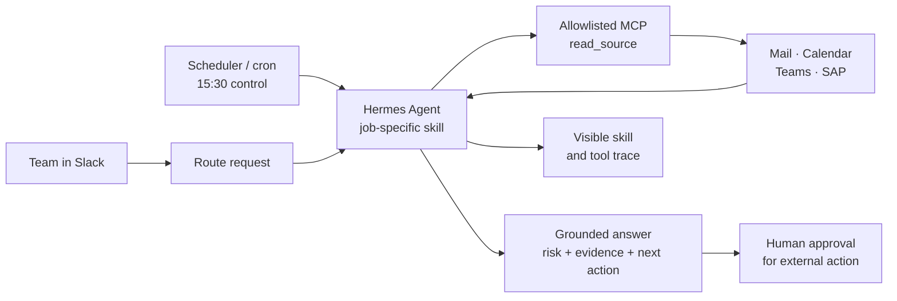

# John — an AI agent for enterprise workflow handoffs

<strong>One workspace. Connected context. Grounded decisions. Safe actions.</strong>

## The problem

Enterprise systems contain the answer, but workflows fail **between systems and owners**. Finance updates SAP, Operations works from email, deadlines live in calendars, and ownership was agreed in a meeting. Nobody sees the complete state when action is due.

- **Missed handoff:** INV-2048 moved to processing, but Mano missed the shared-mailbox update. The supplier received no answer before noon, putting a delivery slot and trust at risk.
- **Duplicate-payment risk:** a corrected ₹7.2 lakh invoice arrived with a new ID. Both records looked valid alone and entered the SAP queue.

Dashboards expose records, rules handle known paths, and chatbots answer questions. None owns the cross-system decision and next safe action.

## The proposed solution

**John is a workspace-scoped workflow agent in Slack.** A workspace is the tool integrations connected for one team: Microsoft 365 Mail and Calendar, Teams notes, and SAP invoice records. John can read only those sources.

John identifies the job, loads a skill, opens the minimum relevant sources, reconciles state, and answers with evidence. A scheduler can invoke controls before deadlines. High-impact actions are proposed for review, not executed silently.

## Architecture

## How the AI works

- **DeepSeek V4 Flash** routes the request; it does not answer or open files.
- **DeepSeek V4 Pro + Hermes** follows the skill, chooses allowed source calls, reconciles records, and responds.
- **Scoped MCP:** `read_source` accepts only connected IDs; file, terminal, web, browser, and send tools are disabled.
- **Safety:** removal revokes access, cross-workspace requests are refused, source wording is preserved, and external action requires a gate.
- Skills, tools, scheduling, and visible traces make John an agent—not a chatbot over pasted context.

## What the working prototype proves

1. Start empty; connect/remove four integrations; inspect every JSON value available to John.
2. Play the **without-John** handoff failure through escalation and deadline impact.
3. Ask in Slack. Hermes reads inbox, register, and calendar, then returns status, the 16:00 SAP run, evidence, and a reminder offer.
4. See the loaded skill and every source call; remove a source to disable the request; request another company’s files to prove refusal.
5. Demonstrate the proposed **15:30 cron control**: correlate vendor + PO + amount + revision timing, propose holding the duplicate, and retain an AP reviewer.

**Implemented:** JSON-backed integrations, live inference, Hermes skills, MCP isolation, Slack UI, trace, and refusal.  
**Production next:** live connectors, actual cron, approved reminder/payment-hold actions, durable audit storage, and stronger tenant isolation.

**Outcome:** John closes the gap between “the system was updated” and “the right person took the right action”—before that gap costs money, time, or reputation.
